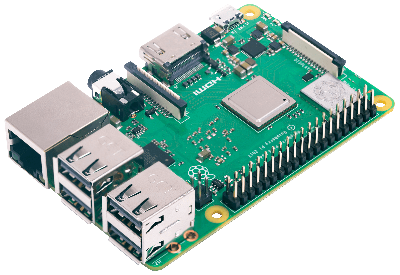
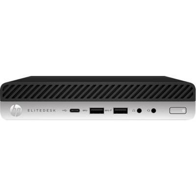

This guide will walk you through the entire process of choosing hardware, setting up your node and operating it.

This project is recommended for developers or aspiring developers since theres not a financial incentive for running a node, unless you have 32 Eth (although there are some workarounds we will go into later on).

The main objectives of this project are:

- Learning how to set up and operate an Ethereum node
- Owning a private node that can be useful for development
- Helping decentralize the Ethereum network

# Choosing the Hardware

It is not a good idea to run a node in your main computer. This is because running a node is fairly resource intensive and will cripple your main computers performance.

Some choose to run a node in services like AWS. We wont be doing this because:
- It is not self-sovereign, meaning that we are not in control of our own node.
- We would contribute to Ethereums centralization, because a lot of nodes are already in services like AWS. (citation needed)

I have found two good options to run a node, with their own advantages and drawdowns:
- Single Board Computers, like a Raspberry Pi.
	- 
	- Pros:
		- Low powered computers
		- Around the size of a credit card

- Tiny computers, like an EliteDesk mini.
	- 
	- d
